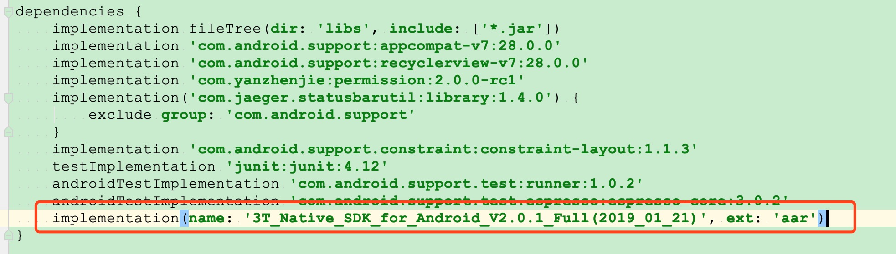

# RTMP推拉流演示

#### 准备工作
1. 在三体云官网SDK下载页 [http://3ttech.cn/index.php?menu=53](http://3ttech.cn/index.php?menu=53) 下载对应平台的 连麦直播SDK。
2. 登录三体云官网 [http://dashboard.3ttech.cn/index/login](http://dashboard.3ttech.cn/index/login) 注册体验账号，进入控制台新建自己的应用并获取APPID。
3. 下载DEMO源码，将APPID填入代码中相应的位置并体验效果。

# 实现步骤

创建 TTT 音视频引擎对象 [create](http://www.3ttech.cn/index.php?menu=72&type=Android#create)

### 推流相关接口

1. 开始推流 [startRtmpPublish](http://www.3ttech.cn/index.php?menu=72&type=Android#startRtmpPublish)
2. 停止推流 [stopRtmpPublish](http://www.3ttech.cn/index.php?menu=72&type=Android#stopRtmpPublish)

### 拉流相关接口

1. 开始拉流 [startIjkPlayer](http://www.3ttech.cn/index.php?menu=72&type=Android#startIjkPlayer)
2. 停止拉流 [stopIjkPlayer](http://www.3ttech.cn/index.php?menu=72&type=Android#stopIjkPlayer)

# Android 使用说明
1. 引用 SDK 的 aar包，在app项目下的 **build.gradle** 文件中添加红框中相应代码来引用。
 
 
 

2. 将申请到的 **APPID** 填入 SDK 的初始化函数 **create** 中，如下图所示。

 
3. 最后编码代码即可运行Demo。

#### 运行环境和要求

> Android Studio 3.5 +  
> minSdkVersion 16  
> gradle 5.4.1  
> java 8.0  

#### 权限要求

>必要权限:  
**android.permission.RECORD_AUDIO** ---> SDK音频模块需要使用此权限用来访问麦克风，用于获取本地音频数据。  
**android.permission.INTERNET** ---> SDK的直播和通讯功能，均需要使用网络进行上传。  
**android.permission.BLUETOOTH** ---> SDK的直播和通讯功能，均需要访问蓝牙权限，保证用户能正常使用蓝牙耳机。  
**android.permission.BLUETOOTH_ADMIN** ---> 蓝牙权限。  
**android.permission.MODIFY\_AUDIO\_SETTINGS** ---> SDK的直播和通讯功能，均需要访问音频路由，保证能正常切换听筒，扬声器，耳机等路由切换。  
**android.permission.ACCESS\_NETWORK\_STATE** ---> SDK的直播和通讯功能，均需要访问网络状态。

>非必要权限:    
**android.permission.READ\_PHONE\_STATE** ---> SDK的直播和通讯功能，均需要访问手机通话状态。 
 

# 常见问题
1. 由于部分模拟器会存在功能缺失或者性能问题，所以 SDK 不支持模拟器的使用。
2. 现在暂不提供测试所用的 **APPID** ，Demo 也不包含 **SDK**，无法直接运行。

